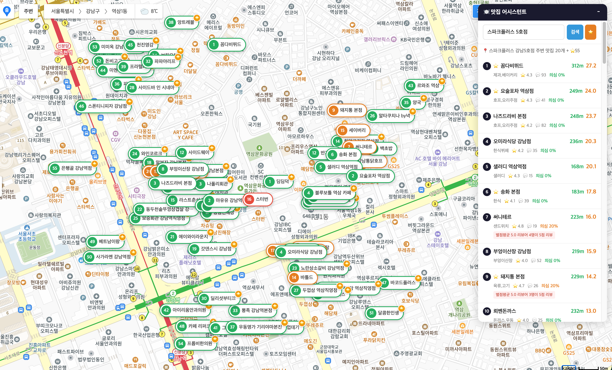
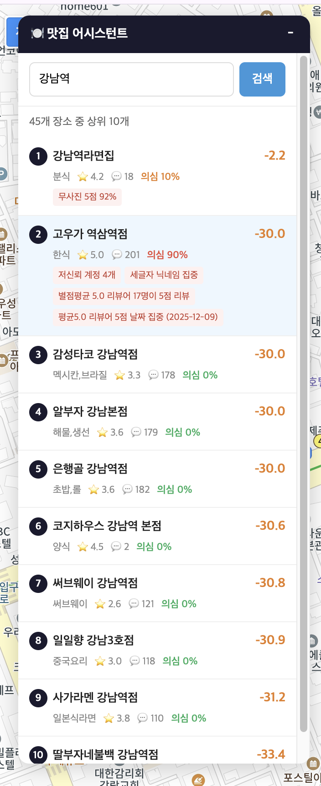

# matjip - 카카오맵 맛집 추천 도구

카카오맵 데이터 기반의 맛집 추천 도구입니다. **9가지 규칙 기반 가짜 리뷰 탐지**로 리뷰 조작 식당을 걸러내고, 즐겨찾기 연동과 종합 스코어링으로 진짜 맛집을 찾아줍니다.

Python CLI와 Chrome 확장 프로그램 두 가지 인터페이스를 제공합니다.

## Screenshots

### Chrome 확장 프로그램 - 카카오맵 연동

카카오맵 위에 플로팅 패널로 검색 결과를 표시하고, 지도에 번호 마커를 표시합니다.



### 가짜 리뷰 탐지 결과

의심도가 높은 식당(90%)은 구체적인 탐지 근거와 함께 표시됩니다.



## 주요 기능

### 4단계 랭킹 파이프라인

1. **즐겨찾기 매칭** - 카카오맵 즐겨찾기와 매칭되면 +100점 가산
2. **리뷰 필터링** - 리뷰 10개 이상 & 평점 4.0 이상 기준 미충족 시 -50점
3. **가짜 리뷰 탐지** - 9가지 규칙으로 리뷰 조작 여부 분석 (0~100% 의심도)
4. **종합 스코어링** - 평점(최대 30점) + 리뷰 수(최대 20점) + 페널티

### 9가지 가짜 리뷰 탐지 규칙

| # | 규칙 | 가중치 | 설명 |
|---|------|--------|------|
| 1 | 같은 날짜 5점 집중 | 25 | 같은 날 5점 리뷰 3개 이상 |
| 2 | 유사 닉네임 패턴 | 20 | 닉네임 정규화 후 동일 패턴 3개 이상 |
| 3 | 단기간 burst | 20 | 7일 내 5점 리뷰 5개 이상 |
| 4 | 저신뢰 계정 | 15 | 리뷰 1~2개 + 팔로워 0 + 평균 4.8+ |
| 5 | 세글자 닉네임 집중 | 10 | 세글자 한글 닉네임 5점 리뷰 4개 이상 |
| 6 | 무사진 5점 비율 | 10 | 사진 없는 5점 리뷰 70% 이상 |
| 7 | 별점평균 5.0 리뷰어 집중 | 20 | 평균별점 5.0 리뷰어의 5점 리뷰 3개 이상 |
| 8 | **교차 신호 날짜 집중** | 35 | 평균5.0 리뷰어가 1~2일 내 2명 이상 집중 |
| 9 | 후기 알바 언급 | 30 | "후기알바", "리뷰조작" 등 키워드 탐지 |

규칙 8번은 리뷰어 프로필 메타데이터(평균별점)와 시간 클러스터의 **교차 검증(cross-signal)**으로, 단일 지표보다 정확도가 높습니다.

## 설치

### 요구사항

- Python 3.11+
- [uv](https://github.com/astral-sh/uv) (패키지 관리자)
- 카카오 REST API 키 ([발급 방법](https://developers.kakao.com/docs/latest/ko/getting-started/app))

### CLI 설치

```bash
# 저장소 클론
git clone https://github.com/symoon94/matjip.git
cd matjip

# 의존성 설치
uv sync

# API 키 설정
uv run matjip config set-key YOUR_KAKAO_REST_API_KEY
```

### Chrome 확장 프로그램 설치

1. Chrome에서 `chrome://extensions` 접속
2. 우측 상단 **개발자 모드** 활성화
3. **압축해제된 확장 프로그램을 로드합니다** 클릭
4. `chrome-extension/` 폴더 선택
5. 확장 프로그램 아이콘 클릭 → 카카오 API 키 입력

## 사용법

### CLI

```bash
# 맛집 검색 (기본 상위 10개)
uv run matjip find "강남 한식"

# 상위 20개 검색
uv run matjip find "홍대 이탈리안" --top 20

# 검색 페이지 수 지정
uv run matjip find "수지" --pages 5

# 설정 확인
uv run matjip config show

# 즐겨찾기 관리
uv run matjip fav list
uv run matjip fav add 12345678 "맛있는집" "한식"
uv run matjip fav remove 12345678

# 카카오맵 즐겨찾기 동기화 (Playwright 브라우저 로그인)
uv run matjip fav sync
```

### CLI 출력 예시

```
🍽️  맛집 랭킹: 수지
┌───┬──────────────┬────────┬─────┬─────┬──────┬─────┬──────┬─────────────┬──────────┬────────────────┬─────────────────────────────────┐
│ # │ 식당         │ 카테고리│ 평점│ 리뷰│ 즐찾 │의심%│ 점수 │ 근거        │ 운영     │ 주소           │ 링크                            │
├───┼──────────────┼────────┼─────┼─────┼──────┼─────┼──────┼─────────────┼──────────┼────────────────┼─────────────────────────────────┤
│ 1 │ 엄마손맛칼국수│ 칼국수 │ 4.4 │ 107 │      │     │ 30.7 │ 평점+12.0…  │ 11:00~…  │ 경기 용인시…   │ https://place.map.kakao.com/…   │
│ 2 │ 황소고집      │ 육류   │ 4.5 │  56 │      │ 20% │ 11.2 │ 평점+15.0…  │ 11:00~…  │ 경기 용인시…   │ https://place.map.kakao.com/…   │
└───┴──────────────┴────────┴─────┴─────┴──────┴─────┴──────┴─────────────┴──────────┴────────────────┴─────────────────────────────────┘
```

### Chrome 확장 프로그램

1. [map.kakao.com](https://map.kakao.com) 접속
2. 우측 상단 **맛집 어시스턴트** 패널에서 검색어 입력
3. 검색 결과 클릭 시:
   - 지도가 해당 위치로 이동
   - 카카오맵 왼쪽 패널에 해당 식당 검색
   - 지도에 번호 마커 표시 (의심도별 색상: 초록/노랑/빨강)
4. [place.map.kakao.com](https://place.map.kakao.com) 개별 식당 페이지에서 자동 분석 배지 표시

## 프로젝트 구조

```
matjip/
├── src/restaurant_assistant/
│   ├── cli.py              # Typer CLI (find, config, fav 명령어)
│   ├── models.py           # 데이터 모델 (Place, Review, ScoredPlace 등)
│   ├── search.py           # 카카오 장소 검색 API
│   ├── reviews.py          # 리뷰 조회 API + 필터링
│   ├── fake_review.py      # 9가지 규칙 기반 가짜 리뷰 탐지
│   ├── ranking.py          # 4단계 랭킹 파이프라인
│   ├── favorites.py        # 즐겨찾기 관리
│   ├── sync_favorites.py   # Playwright 카카오 로그인 + 동기화
│   └── config.py           # ~/.matjip/ 설정 관리
│
├── chrome-extension/
│   ├── manifest.json       # MV3 확장 프로그램 설정
│   ├── background.js       # Service Worker (검색 + 분석 파이프라인)
│   ├── content.js          # 카카오맵 UI 주입 (패널, 검색 연동)
│   ├── map-bridge.js       # MAIN world 지도 API 브릿지
│   ├── popup.html/js       # API 키 설정 팝업
│   ├── styles.css          # 패널/마커/배지 스타일
│   └── rules.json          # declarativeNetRequest 헤더 규칙
│
├── tests/
│   └── test_fake_review.py # 가짜 리뷰 탐지 테스트 (21개)
│
├── requirements/
│   └── restaurant-agent.md # 기능 스펙
│
└── knowledge/
    └── solutions/          # 프로젝트 인사이트 문서
```

## 기술 스택

| 구분 | 기술 |
|------|------|
| CLI | Python 3.11+, [Typer](https://typer.tiangolo.com/), [Rich](https://rich.readthedocs.io/) |
| HTTP | [httpx](https://www.python-httpx.org/) (비동기) |
| 브라우저 자동화 | [Playwright](https://playwright.dev/python/) (즐겨찾기 동기화) |
| Chrome 확장 | Manifest V3, Service Worker, Content Scripts |
| 지도 연동 | MAIN world content script + Proxy 기반 SDK 인스턴스 캡처 |
| 테스트 | pytest + pytest-asyncio |
| 패키지 관리 | [uv](https://github.com/astral-sh/uv) + [hatchling](https://hatch.pypa.io/) |

## API

카카오맵의 공식 및 내부 API를 사용합니다:

| API | 용도 | 인증 |
|-----|------|------|
| `dapi.kakao.com/v2/local/search/keyword.json` | 장소 검색 | REST API 키 |
| `place-api.map.kakao.com/places/panel3/{id}` | 식당 메타데이터 (평점, 리뷰 수, 운영시간) | 없음 |
| `place-api.map.kakao.com/places/tab/reviews/kakaomap/{id}` | 개별 리뷰 데이터 | 없음 |

> **참고**: 내부 API(`place-api`)는 쿼리 파라미터 없이 호출해야 합니다. 파라미터를 추가하면 400 에러가 발생합니다.

## 개발

```bash
# 테스트 실행
uv run pytest tests/ -v

# 린트
uv run ruff check src/

# Playwright 브라우저 설치 (즐겨찾기 동기화용)
uv run playwright install chromium
```

## 설정 파일

모든 설정은 `~/.matjip/`에 저장됩니다:

| 파일 | 내용 |
|------|------|
| `config.json` | 카카오 REST API 키 |
| `favorites.json` | 즐겨찾기 목록 |
| `folder_names.json` | 카카오맵 즐겨찾기 폴더 이름 |
| `kakao_auth.json` | Playwright 인증 상태 |

## 라이선스

MIT
